# Assignment 2 - Data Structures Report

## 1. Introduction

This assignment implements three custom data structures from scratch:

- DynamicArray
- MyLinkedList
- MinHeap

The goal was to compare their theoretical complexity and real performance on different workloads.

The structures use primitive `int` values and do not use `java.util.ArrayList`, `java.util.LinkedList`, or `java.util.PriorityQueue`.

The assignment also includes:

- operation counters for steps, moves, and comparisons;
- JUnit 5 tests;
- benchmark workloads W1-W4;
- CSV export;
- performance plots;
- loop invariant proofs;
- asymptotic complexity analysis.

The benchmark uses the same random seed, `new Random(42)`, to make the results reproducible.

---

# 2. Implemented Data Structures

## 2.1 DynamicArray

`DynamicArray` stores values in an internal `int[]`.

Supported operations:

- `add(x)`
- `add(index, x)`
- `remove(index)`
- `get(index)`
- `contains(x)`

When the internal array becomes full, its capacity is doubled.

This gives amortized constant-time insertion at the end.

## 2.2 MyLinkedList

`MyLinkedList` is implemented as a singly linked list.

Each node contains:

- an integer value;
- a reference to the next node.

The implementation also stores both `head` and `tail`.

The `tail` reference allows `add(x)` at the end of the list to run in constant time.

Supported operations:

- `add(x)`
- `add(index, x)`
- `remove(index)`
- `get(index)`
- `contains(x)`

## 2.3 MinHeap

`MinHeap` is implemented using an internal `int[]`.

Supported operations:

- `insert(x)`
- `peekMin()`
- `extractMin()`

Insertion uses bubble-up.

Removal of the minimum element uses bubble-down.

The minimum value is always stored at index `0`.

---

# 3. Complexity Analysis

## 3.1 DynamicArray

| Operation | Best Case | Average Case | Worst Case | Auxiliary Space | Explanation |
|---|---|---|---|---|---|
| add(x) | Θ(1) | Θ(1) amortized | Θ(n) | Θ(n) during resize | Usually inserts at the end, but resizing copies all elements |
| add(index, x) | Θ(1) | Θ(n) | Θ(n) | Θ(n) during resize | Elements after the index may need to be shifted |
| remove(index) | Θ(1) | Θ(n) | Θ(n) | Θ(1) | Elements after the removed value are shifted left |
| get(index) | Θ(1) | Θ(1) | Θ(1) | Θ(1) | Direct array indexing |
| contains(x) | Θ(1) | Θ(n) | Θ(n) | Θ(1) | Linear search |

## 3.2 MyLinkedList

| Operation | Best Case | Average Case | Worst Case | Auxiliary Space | Explanation |
|---|---|---|---|---|---|
| add(x) | Θ(1) | Θ(1) | Θ(1) | Θ(1) | Tail reference allows direct insertion |
| add(index, x) | Θ(1) | Θ(n) | Θ(n) | Θ(1) | Must traverse to the required position |
| remove(index) | Θ(1) | Θ(n) | Θ(n) | Θ(1) | Removing the head is constant time, other indexes require traversal |
| get(index) | Θ(1) | Θ(n) | Θ(n) | Θ(1) | Nodes must be followed from the head |
| contains(x) | Θ(1) | Θ(n) | Θ(n) | Θ(1) | Sequential search through nodes |

## 3.3 MinHeap

| Operation | Best Case | Average Case | Worst Case | Auxiliary Space | Explanation |
|---|---|---|---|---|---|
| insert(x) | Θ(1) | O(log n) | Θ(log n) | Θ(n) during resize | New value may move toward the root |
| peekMin() | Θ(1) | Θ(1) | Θ(1) | Θ(1) | Minimum value is stored at index 0 |
| extractMin() | Θ(1) | O(log n) | Θ(log n) | Θ(1) | Root is replaced and bubble-down restores heap property |

---

# 4. Loop Invariant Proofs

## 4.1 DynamicArray contains(x)

### Invariant

Before every iteration of the loop, all elements in positions from `0` to `i - 1` have already been checked and none of them is equal to `x`.

### Initialization

Before the first iteration, `i = 0`.

No elements have been checked yet.

Therefore, the invariant is true.

### Maintenance

During the iteration, `data[i]` is compared with `x`.

If they are equal, the method returns `true`.

If they are not equal, the algorithm continues to the next index.

Therefore, before the next iteration, every element from `0` to `i` has been checked and none is equal to `x`.

The invariant remains true.

### Termination

The loop terminates when `i == size`.

At this point, every valid element in the array has been checked.

If no value was equal to `x`, the method returns `false`.

### Conclusion

The invariant proves that `contains(x)` correctly returns `true` if the value exists and `false` if it does not.

## 4.2 MinHeap bubble-down in extractMin()

### Invariant

Before every iteration of the bubble-down loop, the heap property is valid everywhere except possibly between the current node and its children.

### Initialization

After the minimum value is removed, the last heap element is moved to the root.

All other parent-child relationships remain unchanged.

Therefore, only the new root may violate the heap property.

The invariant is true.

### Maintenance

The algorithm compares the current node with its left and right children.

If one of the children is smaller, the current node is swapped with the smallest child.

After the swap, the heap property is restored at the previous position.

The possible violation moves downward to the new current position.

Therefore, the invariant remains true.

### Termination

The loop stops when the current node is smaller than or equal to both children, or when it has no children.

At this point, there is no remaining violation.

### Conclusion

Because the possible heap violation moves downward until it disappears, the complete MinHeap property is restored after `extractMin()`.

---

# 5. Benchmark Methodology

The benchmark uses the following values of `n`:

- 100
- 1,000
- 10,000
- 100,000

All input values are generated using:

```java
new Random(42)
```

Each benchmark case is executed five times.

The median execution time is stored.

A warm-up phase is executed before measurements so that JVM startup and JIT compilation have less influence on the results.

The following metrics are recorded:

- `time_ms`
- `steps`
- `moves`
- `comparisons`

The results are saved to:

```text
results/results.csv
```

---

# 6. Benchmark Results

## 6.1 W1 - Random Access

W1 performs 10,000 random `get(index)` operations.

For `n = 100000`:

- DynamicArray: approximately **0.094 ms**
- MyLinkedList: approximately **1053.476 ms**

The difference is very large.

DynamicArray performs exactly one direct array access for every `get(index)`.

MyLinkedList must follow node references from the head until the requested index is reached.

The measured step counts clearly show this difference.

For `n = 100000`:

- DynamicArray: `10,000` steps
- MyLinkedList: `502,499,208` steps

This result matches the expected theoretical complexity:

- DynamicArray `get()` = Θ(1)
- MyLinkedList `get()` = Θ(n)

## 6.2 W2 - Search

W2 performs 1,000 `contains(x)` queries.

Half of the searched values are present and half are absent.

For `n = 100000`:

- DynamicArray: approximately **25.541 ms**
- MyLinkedList: approximately **193.133 ms**

Both structures performed the same number of logical element comparisons:

- `73,728,608` comparisons

However, DynamicArray was significantly faster.

This is caused by memory layout.

The array stores elements contiguously in memory, while linked-list nodes are separate objects connected by references.

## 6.3 W3 - Insert and Remove at Head

W3 head performs:

- 1,000 insertions at index 0;
- 1,000 removals at index 0.

For `n = 100000`:

- DynamicArray: approximately **13.130 ms**
- MyLinkedList: approximately **0.027 ms**

The linked list is much faster.

The DynamicArray must shift a very large number of elements.

For `n = 100000`:

- DynamicArray moves: `200,999,000`
- MyLinkedList moves: `3,000`

This demonstrates a workload where a linked list has a clear advantage.

## 6.4 W3 - Insert and Remove in Middle

W3 middle performs insertions and removals around `size / 2`.

For `n = 100000`:

- DynamicArray: approximately **6.887 ms**
- MyLinkedList: approximately **151.729 ms**

The DynamicArray performs a large number of shifts:

- `100,499,500` moves

However, these moves happen in contiguous memory.

The linked list performs many pointer traversals:

- `100,498,500` steps

Even though both operations have Θ(n) complexity, the DynamicArray is much faster in real execution.

## 6.5 W4 - Priority Processing

W4 inserts all values into a MinHeap and then repeatedly calls `extractMin()`.

For `n = 100000`:

- Time: approximately **11.667 ms**
- Steps: `9,638,440`
- Moves: `4,848,370`
- Comparisons: `3,059,125`

The extracted values were checked to ensure they were returned in non-decreasing order.

The results confirm that the heap property is maintained.

---

# 7. Plots

The generated benchmark plots are stored in:

```text
results/plots/
```

## W1 - Random Access

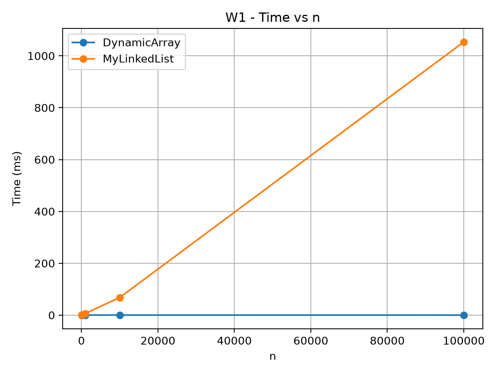

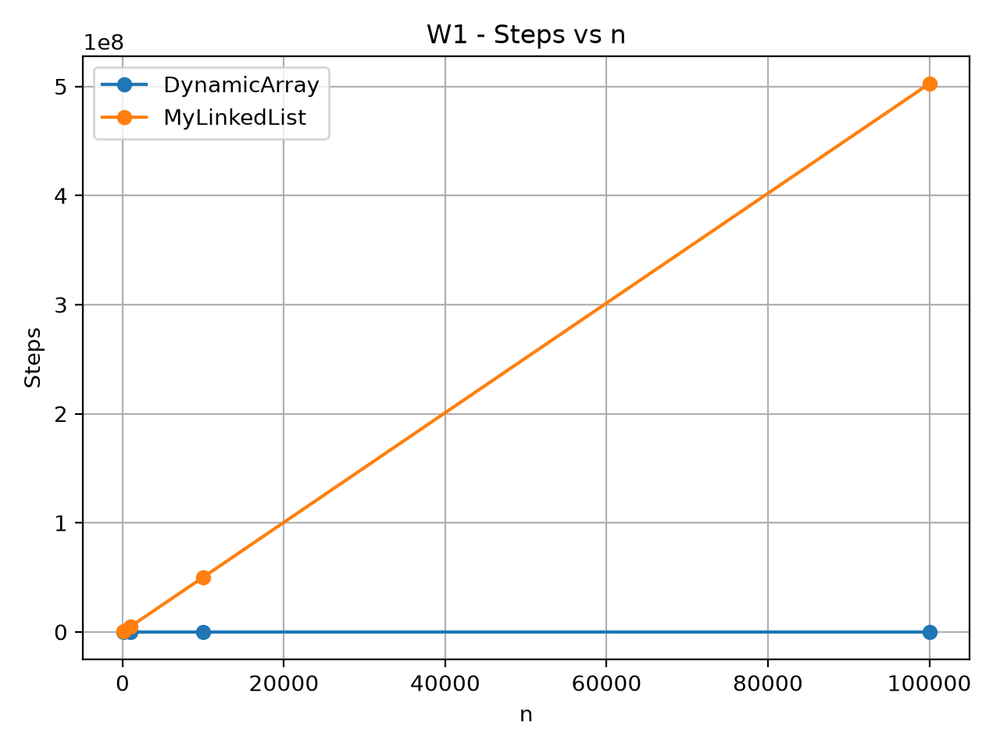

## W2 - Search

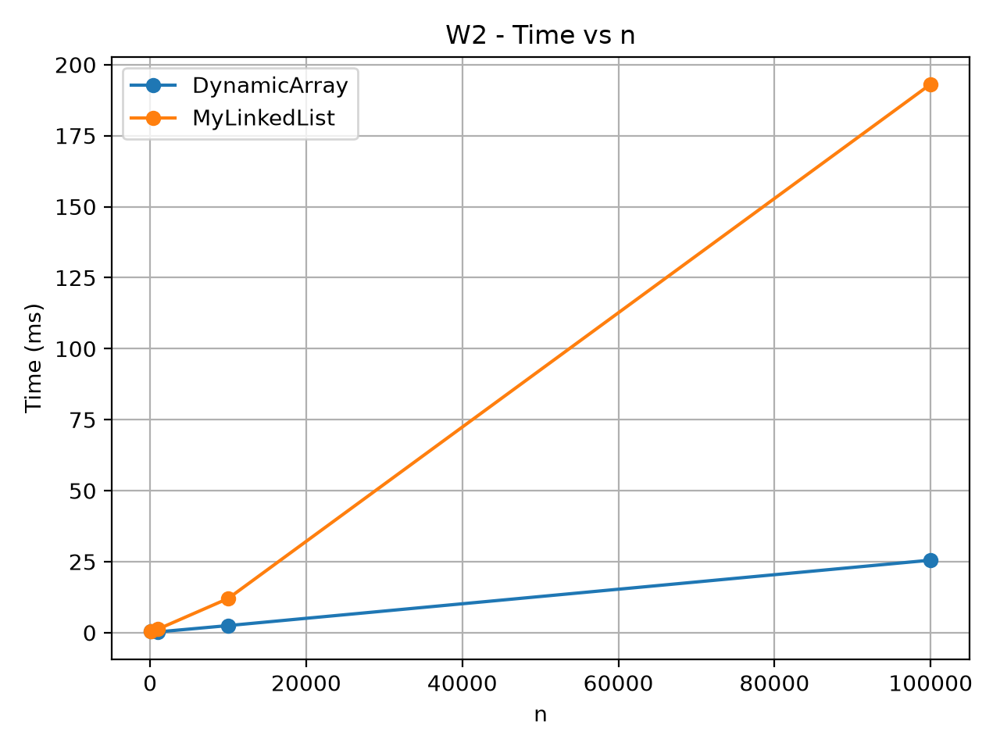

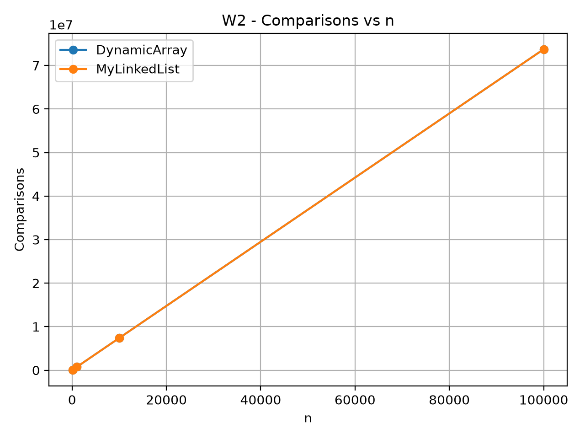

## W3 - Head

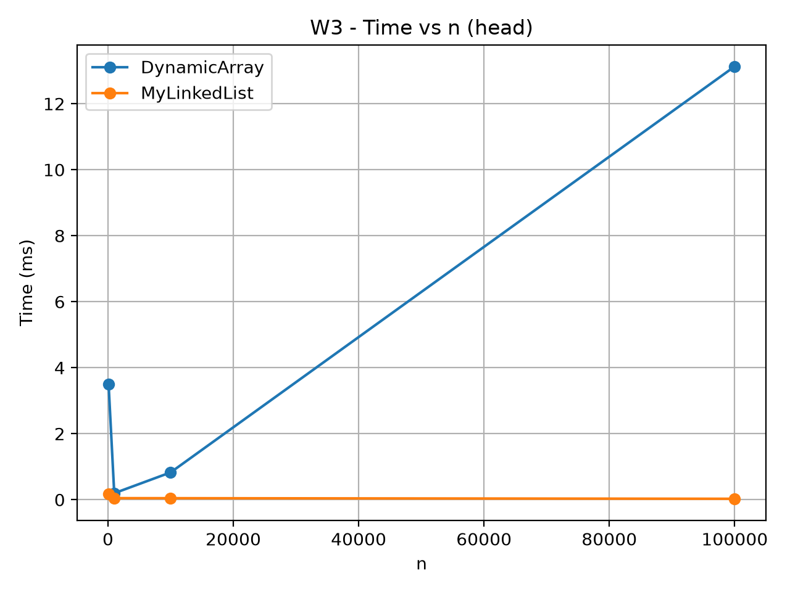

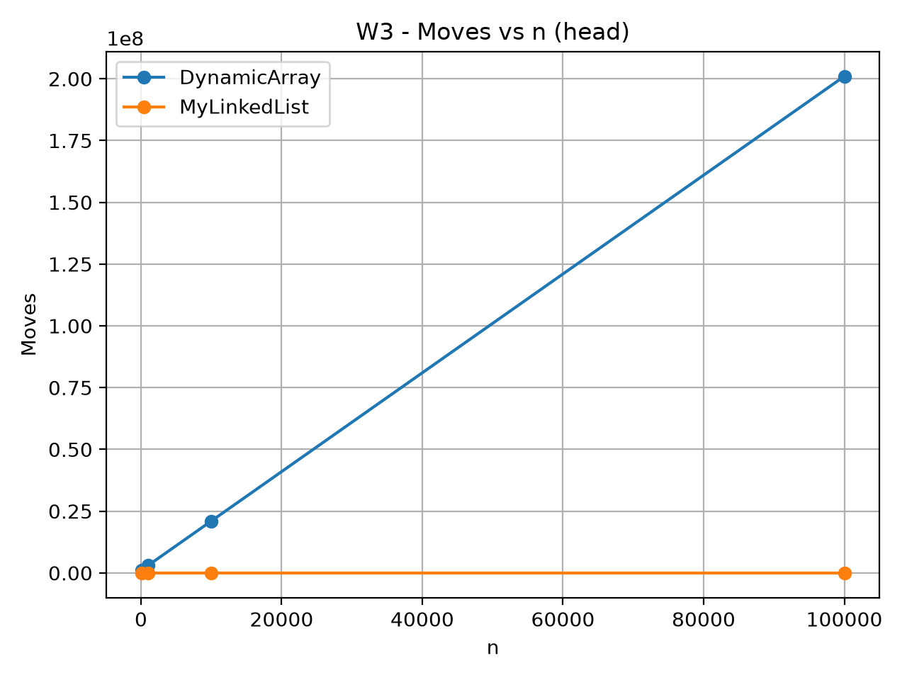

## W3 - Middle

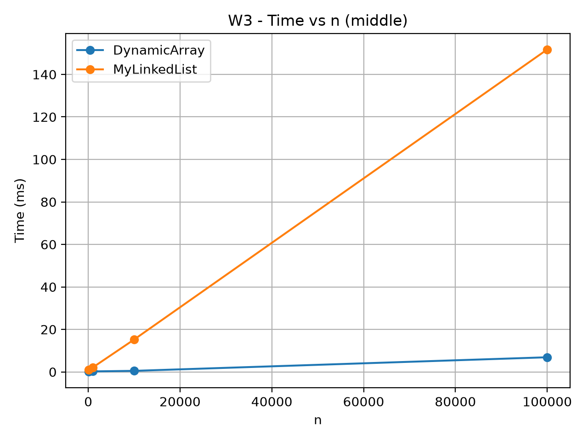

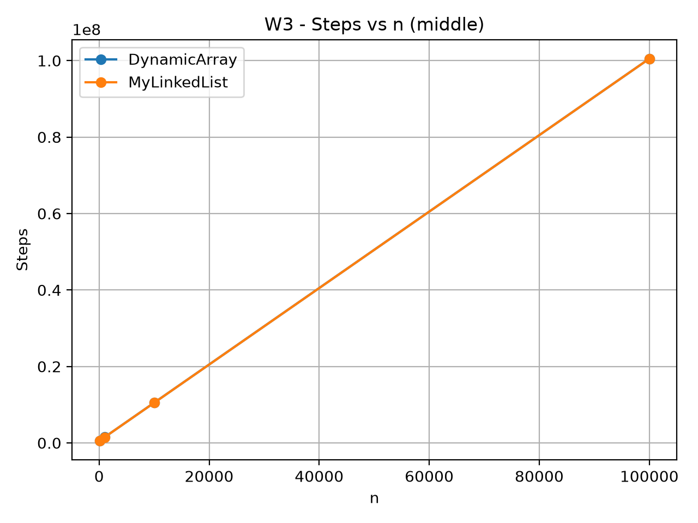

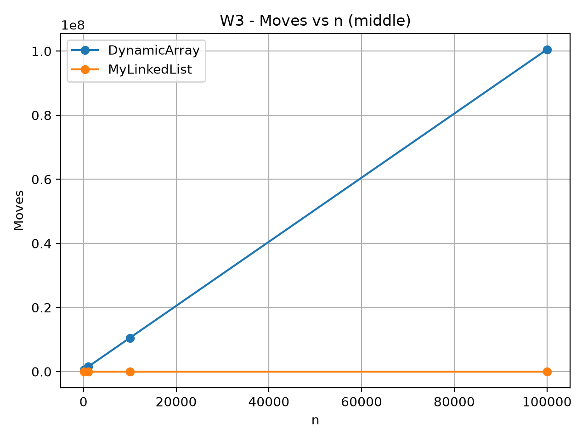

## W4 - Priority Processing

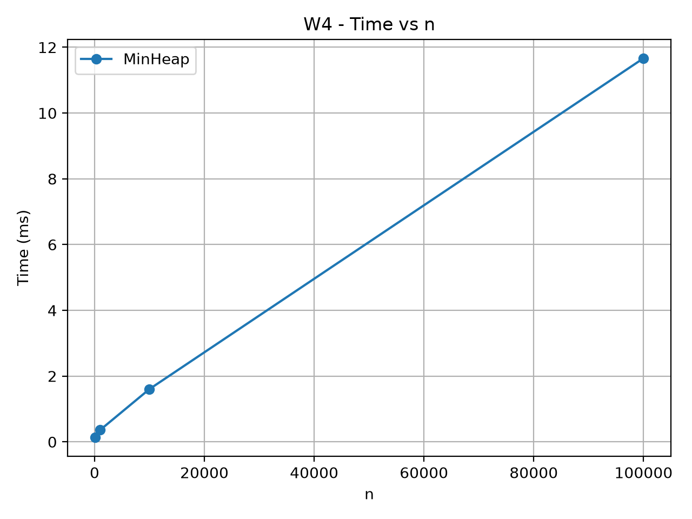

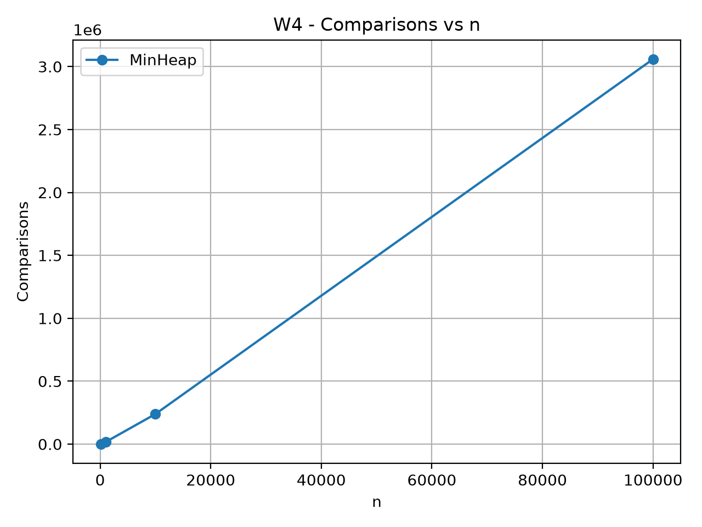

---

# 8. Discussion

DynamicArray is much faster than MyLinkedList for random access because array elements are stored in contiguous memory.

The CPU can calculate the address of an array element directly from its index.

MyLinkedList must follow references from one node to another.

This process is called pointer chasing.

Pointer chasing creates more memory accesses and reduces CPU cache efficiency.

DynamicArray also benefits from spatial locality because nearby array values are often loaded into the same CPU cache line.

This explains why DynamicArray can be faster even when both structures perform a similar number of logical operations.

The W2 search workload demonstrates this effect clearly.

DynamicArray and MyLinkedList performed the same number of element comparisons, but DynamicArray was significantly faster.

Linked lists also have additional memory overhead because every node is an object containing both a value and a reference.

The garbage collector must also manage these node objects.

MyLinkedList is a better choice when frequent insertions and removals happen at the beginning of the structure.

This is demonstrated by W3 head, where MyLinkedList was much faster than DynamicArray.

For middle operations, both structures have linear complexity, but DynamicArray can still be faster because shifting contiguous array values is cache-friendly.

MinHeap is the best structure among the implemented structures when repeated minimum-priority processing is required.

It supports constant-time access to the minimum value and logarithmic insertion and extraction.

Therefore, the best data structure depends on the workload rather than only on Big-O notation.

---

# 9. Testing

JUnit 5 tests were implemented for all three structures.

The tests cover:

- adding elements;
- removing elements;
- getting values;
- search;
- duplicate values;
- first index;
- last index;
- invalid indexes;
- empty structures;
- array resizing;
- heap property;
- sorted heap output.

All tests passed successfully.

---

# 10. Conclusion

This assignment demonstrated both theoretical and practical differences between data structures.

DynamicArray is very efficient for indexed access and sequential memory access.

MyLinkedList performs very well for insertion and removal at the head, but random access is expensive.

MinHeap provides efficient priority-based processing.

The benchmark also demonstrated that Big-O complexity does not explain every real performance difference.

CPU cache behavior, memory locality, pointer chasing, and object overhead strongly influence actual running time.

The results confirmed that the correct choice of data structure should depend on the expected workload.

---

# 11. GitHub Repository

GitHub repository:

https://github.com/IShaymerden/DAA_Assignment2

Main branch:

```text
main
```

Release tag:

```text
v1.0
```